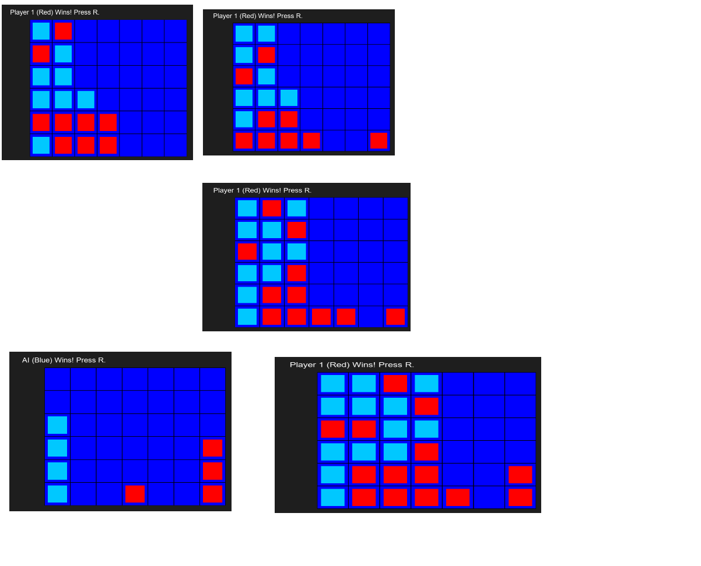

# Project 04 – Connect-Four SDL

## 🕹️ Description

This is a graphical Connect-Four game written in C++ using SDL2. It features a human vs AI mode, colored tokens, an immediate AI's response after the Player 1, displaying the winner, and restart functionality.

## 🎮 Controls

- Click on a column to place your token
- Press `R` to restart the game
- Press `Esc` to quit

## 🧪 Screenshot



## 🛠️ Build Instructions

```bash
sudo apt install libsdl2-dev
g++ main.cpp game.cpp -lSDL2 -o connect4
./connect4
